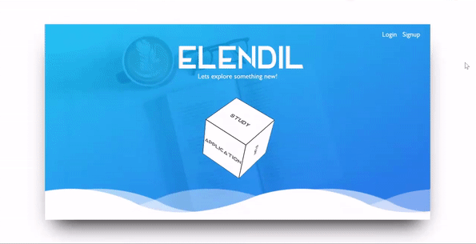
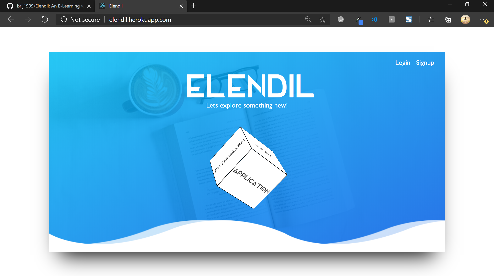
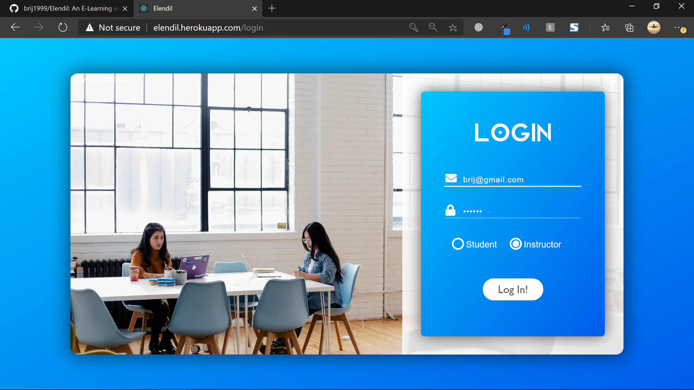
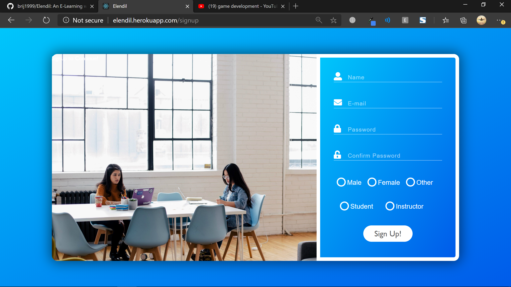
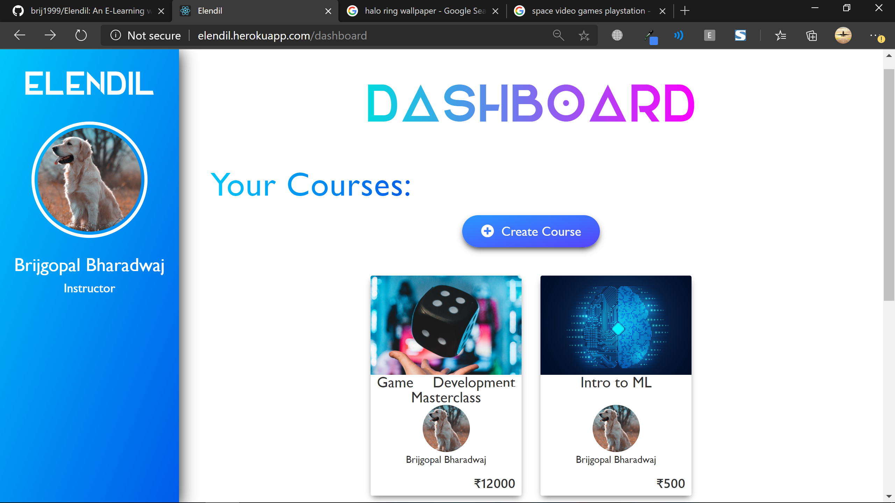
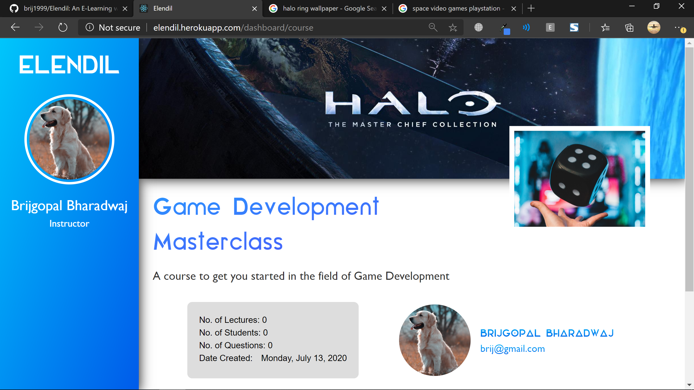
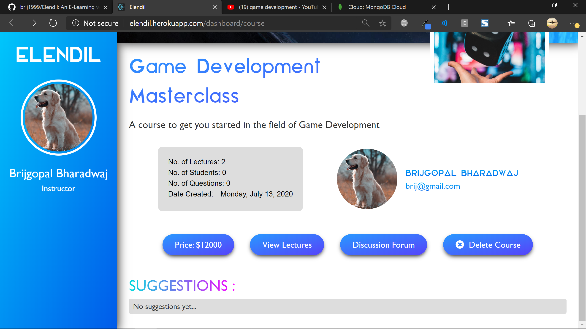
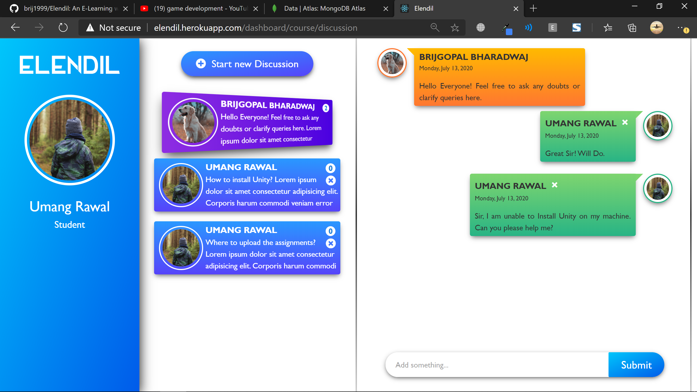

# [**Elendil**](http://elendil.herokuapp.com/)

An E-Learning website, based on the **MERN** stack. 
[Visit&nbsp;the&nbsp;live&nbsp;website](http://elendil.herokuapp.com/)

This project was bootstrapped with [Create React App](https://github.com/facebook/create-react-app).

---

## Required Environment Variables

VARIABLE | Sample value
--- | ---
KEY | sample_key
URI | mongodb://localhost/elendilDB

## Installation Instructions

1. Install *Node.js*
1. Install *npm*
1. If you plan to use a local instance of *MongoDB database*, install *MongoDB atlas*.
1. Clone this github repo.
1. In the local project directory, create a new file called "`.env`".
1. Setup the environment variables as described above.
1. Open the local project directory in a terminal, and run: `npm install`.
1. run: `npm run dev`.

## Available Scripts

In the project directory, you can run:

### `npm run dev`

Runs the app in the development mode. 
Open [http://localhost:3000](http://localhost:3000) to view it in the browser.

The page will reload if you make edits. 
You will also see any lint errors in the console. Please note that this loads the server on [http://localhost:8000](http://localhost:8000). Make use of this to browse the back-end API. Also note that the server requires an active instance of the **MongoDB database**. Either provide a *MongoDB atlas* link in the `URI` environment variable, or use a local database, by placing its URI in the same.

### `npm run client`

Runs the front-end client app in the development mode. 
Open [http://localhost:3000](http://localhost:3000) to view it in the browser.

### `npm run server`

Runs the back-end server app in the development mode. 
Open [http://localhost:8000](http://localhost:8000) to view it in the browser. Please note that the server requires an active instance of the **MongoDB database**. Either provide a *MongoDB atlas* link in the `URI` environment variable, or use a local database, by placing its URI in the same.

---

## Application Screenshots

